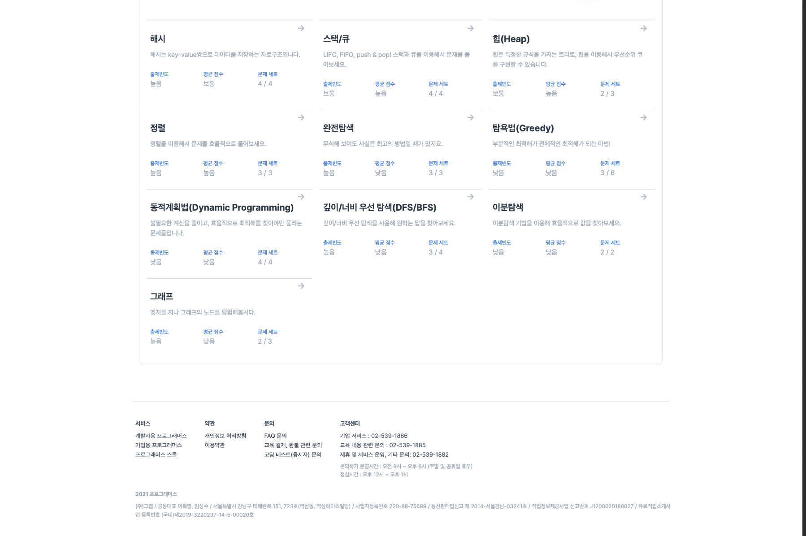

# HTML-CSS-Challenge

`HTM`L과 `CSS`를 이용하여 UI를 클론 코딩하는 repository입니다.

`JavaScript`가 추가될 수 있습니다.

## 1. 프로그래머스 챌린지

[프로그래머스 챌린지 사이트](https://programmers.co.kr/learn/challenges)를 기반으로 작성되었습니다.

### 모바일

### 태블릿

### 데스크탑

